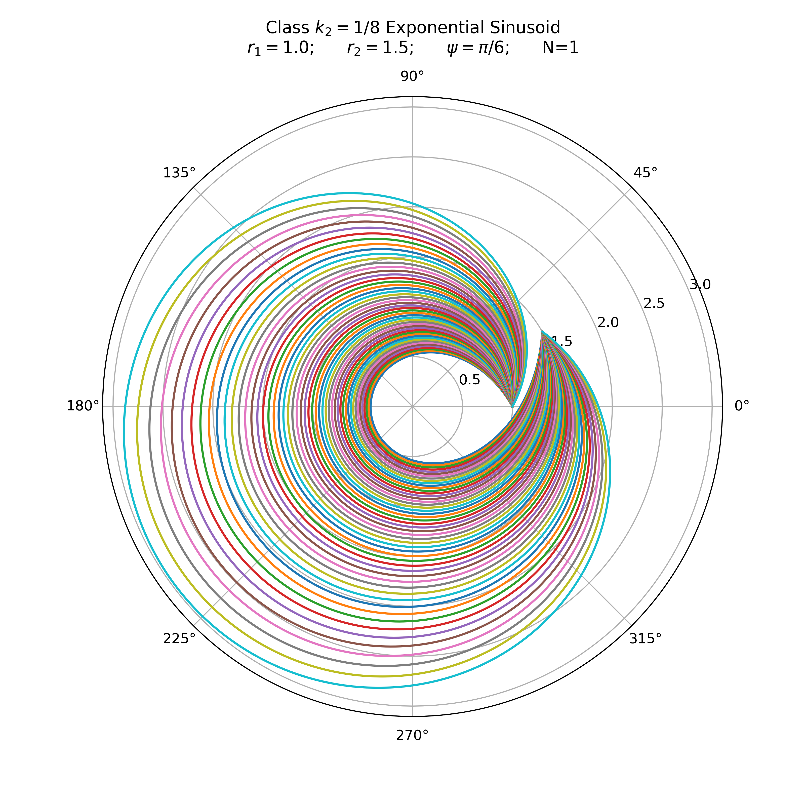

LOW Thrust Lambert Targeter
===========================

This repository serves as both a (1) feature under development for use with Tudat_ and an (2) example for the use of
Cython_ to wrap C++ libraries in Python accessible modules.

.. WARNING::
   No unit tests or module tests are in place to ensure correct installation or implementation as of yet!
   This will be resolved soon.

Versioning
----------

+----------+-----------------------------------------------------------------------------------------+
| Version  | Note                                                                                    |
+----------+-----------------------------------------------------------------------------------------+
| v1.0.0   | First release with exponential sinusoids formulated for Lambert's Problem (Izzo, 2006). |
+----------+-----------------------------------------------------------------------------------------+

Upcoming features
-----------------

- Class for three dimensional use of the 2D Lambert formulation of exponential sinusoids for LOW thrust.
- Routines for optimal computation of Lambert solution fitness, thrust-guidance law and propulsion system feasibility check.

Installing (Python)
-------------------

Clone the repository:

.. code-block:: bash

    git clone https://github.com/ggarrett13/lamberts-problem-for-exponential-sinusoids.git

Install Cython (preferably in a virtual environment):

.. code-block:: bash

    pip3 install Cython

Use your flavour of text editor commands to add the TudatBundle absolute path to the setup.ini config file.

.. code-block:: bash

    cd lamberts-problem-for-exponential-sinusoids
    gedit setup.ini

Install. Note that if you do not correctly define the TudatBundle path, installation will fail.

.. code-block:: bash

    python3 setup.py build_ext --inplace

Examples
--------

.. code-block:: python

    from lambert_exponential_sinusoid import ExponentialSinusoidFamily
    import numpy as np
    import matplotlib.pyplot as plt

    # Define exponential sinusoid family parameters.
    winding_parameter = k2 = 1 / 8.
    initial_radial_distance = r1 = 1.
    final_radial_distance = r2 = 1.5
    angle_ccw_from_r1_to_r2 = psi = np.pi / 6
    number_of_revolutions = N = 1

    # Instantiation of exponential sinusoid family class.
    exponential_sinusoid = ExponentialSinusoidFamily(k2, r1, r2, psi, N)

    # Retrieve flight path limits.
    flight_path_limits = exponential_sinusoid.get_flight_path_limits()

    # Figure plotting.
    plt.figure(figsize=(8, 8), dpi=400)
    ax = plt.subplot(111, projection='polar')
    for initial_flight_path_angle in np.linspace(flight_path_limits[0] * 0.4, flight_path_limits[1] * 0.4, 50):
        _r = exponential_sinusoid.get_radial_distance_array(initial_flight_path_angle)
        _theta = exponential_sinusoid.get_theta_array()
        ax.plot(_theta, _r)
    ax.grid(True)
    ax.set_title("Class $k_2={}$ Exponential Sinusoid\n".format(k2) +
                 "$r_1={}$;      ".format(r1) +
                 "$r_2={}$;      ".format(r2) +
                 "$\phi=\pi/{}$;      ".format(int(np.pi/psi)) +
                 "N={}".format(number_of_revolutions)
                 , va='bottom')
    plt.savefig("example1.png")

.. _Tudat: http://tudat.tudelft.nl/index.html
.. _Cython: https://cython.readthedocs.io/en/latest/src/userguide/wrapping_CPlusPlus.html